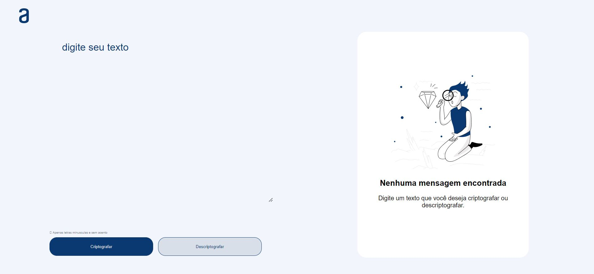
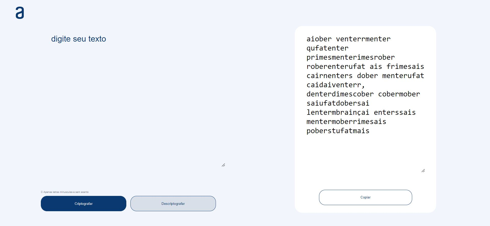

# Challenge Decodificador de Texto

Challenge criado pela Alura, onde temos que desenvolver um decodificador de texto que criptografa e descriptografa o texto, sendo também possível copiar o texto criptografado ou descriptografado, aplicando os conhecimentos ensinados durante a Jornada Iniciante de Programação T7 - ONE.

